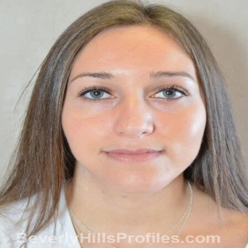
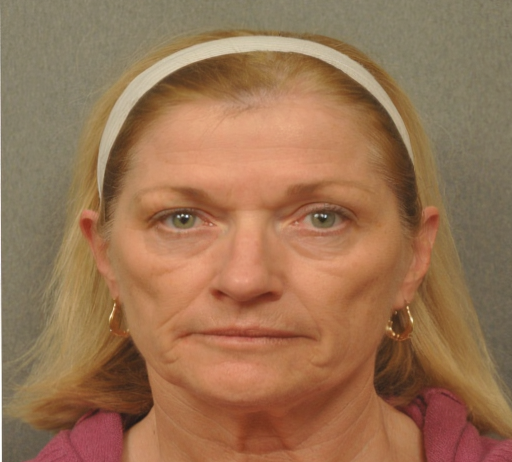
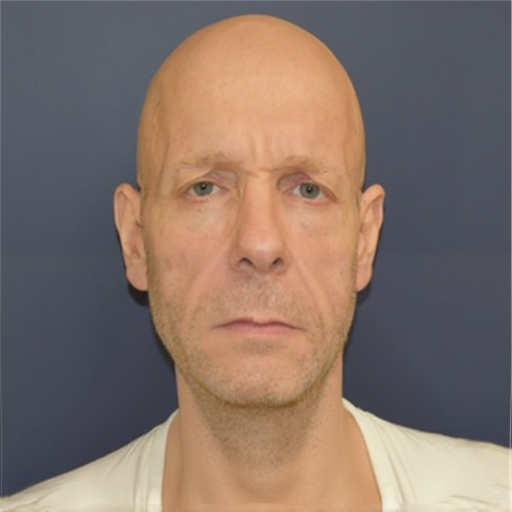

<div align="center">

# Envisage

### Depth-Conditioned Diffusion Inpainting for Facial Surgery Outcome Prediction

[](https://huggingface.co/spaces/dreamlessx/envisage)

[](paper/main.tex)
[](https://www.python.org)
[](https://pytorch.org)
[]()
[](https://github.com/dreamlessx/envisage_public/issues)

*Predict what a patient will look like after facial surgery -- from a single photograph.*

</div>

> **Status: Testing phase.** Envisage is under active development and evaluation. The codebase and [live demo](https://huggingface.co/spaces/dreamlessx/envisage) are functional but not yet validated for clinical use. We welcome feedback via [Issues](https://github.com/dreamlessx/envisage_public/issues) and [Discussions](https://github.com/dreamlessx/envisage_public/discussions).

---

## How It Works

Envisage masks only the surgical region, modifies a monocular depth map to simulate the intended tissue change, and uses **FLUX.1-dev** with a pretrained depth ControlNet to regenerate the masked area. Everything outside the mask is copied from the input -- identity is preserved by construction.

**No task-specific training required.** The surgical knowledge comes entirely from procedure-specific depth modification, not from fine-tuning on surgical data.

<div align="center">

**Landmark Extraction** &rarr; **Mask Generation** &rarr; **Depth Modification** &rarr; **FLUX Inpainting** &rarr; **Prediction**

</div>

1. **Landmark extraction** -- MediaPipe 478-point face mesh identifies the surgical region
2. **Mask generation** -- procedure-specific convex hull with Gaussian feathering
3. **Depth estimation** -- Depth Anything V2 produces a monocular depth map
4. **Depth modification** -- Gaussian displacement at surgical landmarks simulates tissue change
5. **FLUX.1-dev inpainting** -- depth-conditioned ControlNet regenerates the masked region
6. **Identity verification** -- ArcFace cosine similarity confirms same person

---

## Results

### Rhinoplasty
<div align="center">


*Smoother bridge, refined tip. ArcFace identity: 0.904*
</div>

### Blepharoplasty
<div align="center">


*Upper eyelid de-hooding with asymmetric correction. ArcFace identity: 0.905*
</div>

### Rhytidectomy
<div align="center">


*Neck tightening and jawline definition. Upper face pixel-identical to input. ArcFace identity: 0.982*
</div>

### Benchmark (HDA Plastic Surgery Database)

Evaluated on the [HDA benchmark](https://doi.org/10.1109/TIFS.2019.2957344) (67 test pairs, 4 procedures).

| Procedure | N | Envisage ArcFace | Prior (SD 1.5) ArcFace | Envisage LPIPS | Prior LPIPS |
|-----------|---|-----------------|----------------------|----------------|-------------|
| Rhinoplasty | 21 | **0.802** | 0.607 | **0.380** | 0.380 |
| Blepharoplasty | 27 | **0.745** | 0.670 | **0.370** | 0.388 |
| Rhytidectomy | 9 | 0.173 | 0.360 | **0.369** | 0.369 |
| **Overall** | **57** | **0.631** | 0.551 | **0.377** | 0.384 |

Non-surgical region identity preservation: **0.985--0.989** (near-perfect).

---

## Key Contributions

- **Zero-training surgical prediction** -- pretrained depth ControlNet, no task-specific fine-tuning
- **Decomposed identity evaluation** -- ArcFace measured separately on surgical vs non-surgical regions
- **Monk Skin Tone stratification** -- fairness evaluation across the 10-point MST scale
- **Procedure-specific depth modification** -- Gaussian displacement maps for each surgery type

---

## Quick Start

### Live Demo

Try it on Hugging Face Spaces (GPU-accelerated, no install needed):

<div align="center">

[](https://huggingface.co/spaces/dreamlessx/envisage)

</div>

### Local Installation

```bash
git clone https://github.com/dreamlessx/envisage_public.git
cd envisage_public
pip install -r requirements.txt
python app.py
```

Requires GPU with >= 24GB VRAM (A10G, L40S, A100, or A6000). The Gradio demo supports rhinoplasty (3 sub-types), blepharoplasty, and rhytidectomy.

---

## Technical Details

| Component | Implementation |
|-----------|---------------|
| Base model | FLUX.1-dev (Black Forest Labs) |
| ControlNet | jasperai/Flux.1-dev-Controlnet-Depth |
| Depth estimation | Depth Anything V2 Small |
| Face landmarks | MediaPipe 478-point mesh |
| Identity metric | ArcFace (InsightFace buffalo_l) |
| Face restoration | CodeFormer |
| Inference time | ~25s per image on A10G GPU |

---

## Comparison with LandmarkDiff

Envisage is the successor to [LandmarkDiff](https://github.com/dreamlessx/LandmarkDiff-public).

| | LandmarkDiff | Envisage |
|---|---|---|
| Base model | Stable Diffusion 1.5 | FLUX.1-dev |
| Approach | ControlNet conditioning | Depth-conditioned inpainting |
| Training required | Yes (ControlNet fine-tuning) | No (zero-shot) |
| Identity (ArcFace) | 0.551 | **0.631** |
| Non-surgical preservation | Good | **Near-perfect (0.985+)** |
| Resolution | 512x512 | 1024x1024 |
| Fairness metric | Fitzpatrick Scale | Monk Skin Tone Scale |

---

## Project Structure

```
envisage/           Core prediction pipeline
  landmarks.py      MediaPipe 478-point face mesh extraction
  masks.py          Procedure-specific surgical mask generation
  depth.py          Depth Anything V2 + surgical depth modification
  hybrid.py         TPS geometric pre-warp (bridge thinning, eyelid lift)
  evaluation.py     Decomposed ArcFace, DISTS, KID metrics
  fairness.py       Monk Skin Tone Scale classifier
  postprocess.py    CodeFormer face restoration + ArcFace identity gate
  augmentation.py   Clinical degradation transforms
app.py              Gradio interactive demo
paper/              LaTeX source and figures
configs/            Procedure configuration files
```

---

## Limitations

- Research prototype, not a medical device
- Results are approximate predictions, not guaranteed surgical outcomes
- Rhytidectomy (facelift) predictions are weak due to diffuse tissue changes
- Limited skin tone diversity in evaluation dataset
- Requires 24GB+ GPU VRAM for inference

## Clinical Disclaimer

This is an AI-generated surgical prediction for **visualization purposes only**. It is **not** a guarantee of surgical outcome. Clinical decisions should be made by qualified medical professionals. Results may vary based on individual anatomy, surgical technique, and healing response.

---

## Citation

```bibtex
@inproceedings{envisage2026,
  title     = {Envisage: Depth-Conditioned Diffusion Inpainting for
               Facial Surgery Outcome Prediction},
  author    = {Anonymous},
  booktitle = {Under Review},
  year      = {2026}
}
```

---

<div align="center">
<sub>Research use only. Not a medical device. FLUX.1-dev is released under a non-commercial license.</sub>
</div>
