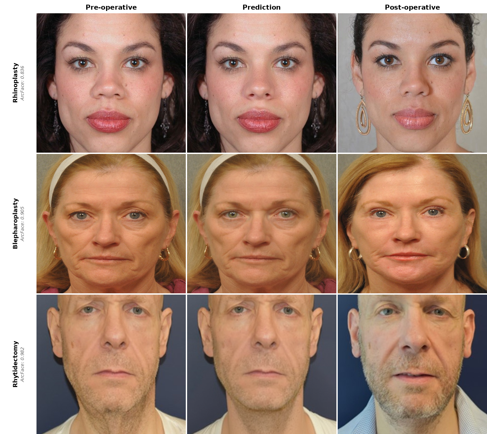
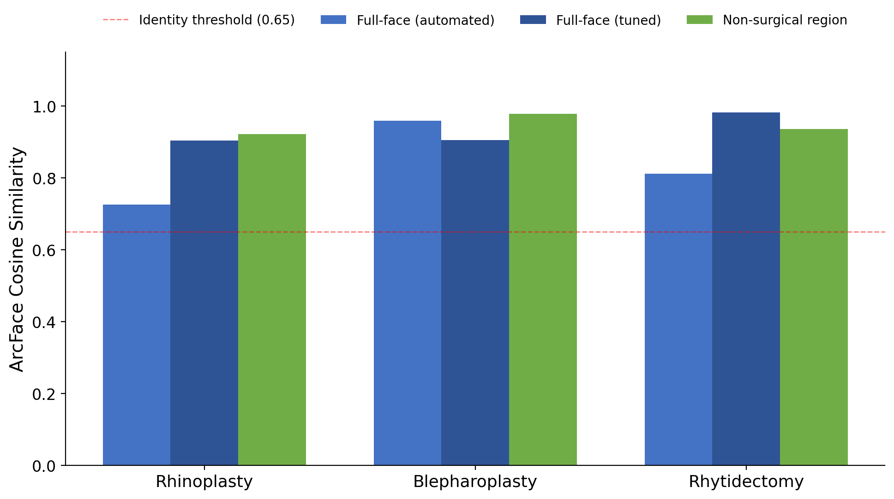
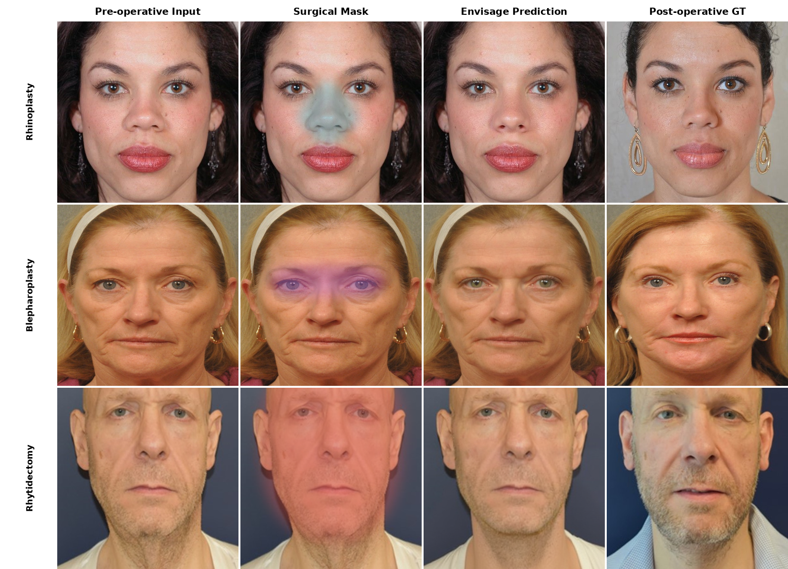
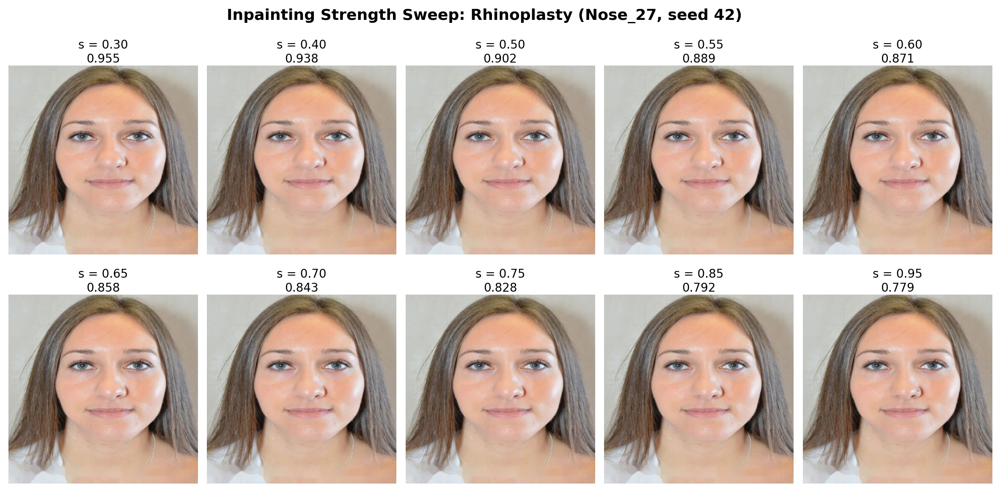
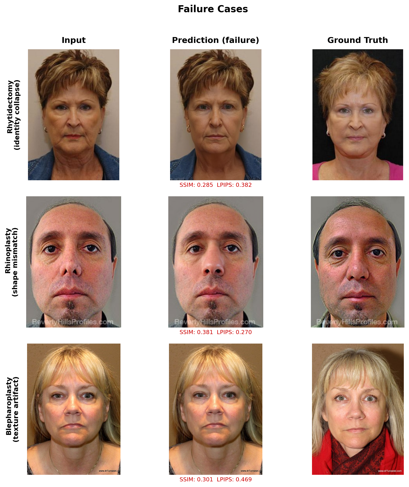
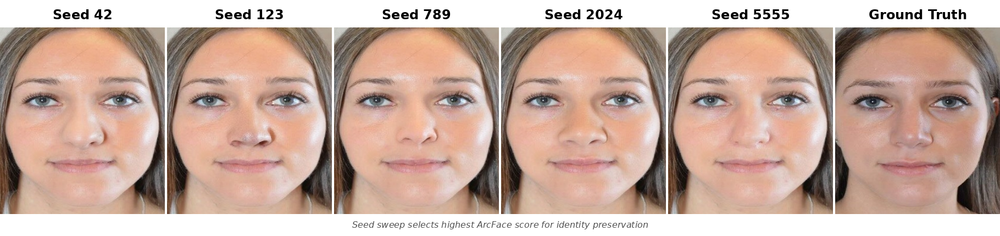
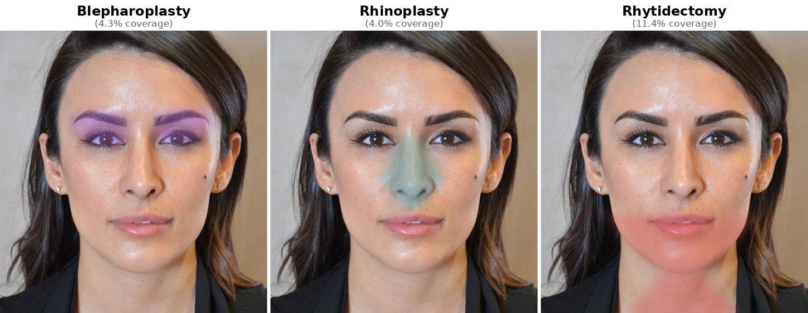
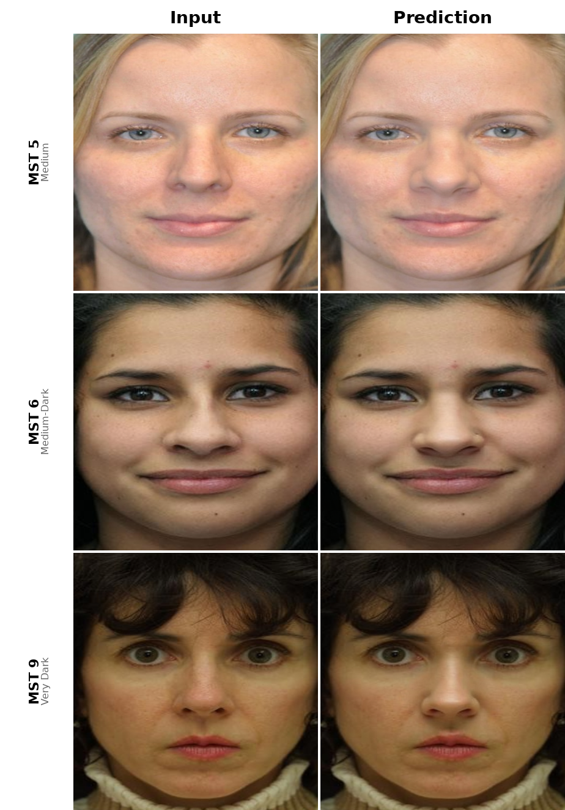

<p align="center">
  <picture>
    <source media="(prefers-color-scheme: dark)" srcset="assets/pipeline.png">
    <source media="(prefers-color-scheme: light)" srcset="assets/pipeline.png">
    
  </picture>
</p>
<h1 align="center">Envisage</h1>
<p align="center">
  <em>Depth-conditioned diffusion inpainting for facial surgery outcome prediction</em>
</p>

<p align="center">
  <a href="https://huggingface.co/spaces/dreamlessx/envisage"></a>
  <a href="#license"></a>
  <a href="https://www.python.org/downloads/"></a>
  <a href="https://pytorch.org/"></a>
  <a href="https://github.com/astral-sh/ruff"></a>
</p>

<br>

Predict what a patient will look like after facial surgery from a single photograph. Zero training required. Identity preserved by architecture, not optimization.

<table align="center">
<tr>
<td width="50%" valign="top">

**Input & Output**
- Single 2D photo: any clinical photo or phone selfie
- Photorealistic post-op prediction via depth-conditioned inpainting
- Only the surgical region is regenerated; all other pixels are copied from the input
- 512x512 resolution, sufficient for clinical facial detail

</td>
<td width="50%" valign="top">

**Capabilities**
- **3 procedures:** rhinoplasty, blepharoplasty, rhytidectomy (facelift)
- **Zero-shot:** pretrained FLUX.1-dev + depth ControlNet, no fine-tuning
- **Adaptive anatomy:** mask dilation, depth kernels, and TPS warp parameters scale with measured facial dimensions
- **Decomposed evaluation:** identity metrics separated by surgical and non-surgical regions

</td>
</tr>
</table>

---

## Why Envisage

Existing approaches to surgical outcome prediction fall into five categories. Each has a fundamental limitation that Envisage was designed to address.

<div align="center">

| Approach | Examples | Core Limitation | Envisage Alternative |
|:---------|:---------|:----------------|:---------------------|
| Commercial hardware systems | Crisalix, Vectra 3D | $30,000 to $50,000 dedicated hardware; proprietary; results not reproducible | Single 2D photo input. Open-source code and evaluation framework. |
| GAN-based prediction | Jung et al. (2024) | 52.5% Visual Turing test pass rate, barely above chance (50%), indicating generated predictions lack photorealism | FLUX.1-dev produces photorealistic outputs zero-shot at 512x512. |
| Landmark-conditioned diffusion | LandmarkDiff (our prior work) | 96% of identity score came from compositing, not the model (rhinoplasty ArcFace: 0.607 composited vs. 0.023 raw). SD 1.5 at 512x512 lacked resolution for clinical detail. | Inpainting preserves identity architecturally. Decomposed ArcFace prevents compositing from inflating metrics. |
| Generic face editors | DragDiffusion, FaceApp | No anatomical priors, no procedure-specific guidance, no clinical evaluation framework | Depth conditioning maps to tissue displacement. Parameters scale with measured anatomy per procedure. |
| 3D morphable models | ACMT-Net, GPOSC-Net | Require CT scans or multi-view input; not accessible from a single photograph | Works from one photo. No CT scans, no depth sensors, no multi-view capture. |

</div>

### What Makes Envisage Different

Seven design properties distinguish Envisage from all of the above.

- **Zero training.** Works out of the box with pretrained FLUX.1-dev. No fine-tuning, no task-specific dataset collection, no synthetic data generation. The pretrained depth ControlNet generalizes to surgical depth modifications without any additional training.
- **Architectural identity preservation.** The inpainting formulation copies all pixels outside the surgical mask verbatim. Identity is preserved by construction, not by optimization or post-hoc compositing. Non-surgical region ArcFace scores range from 0.922 to 0.978 across procedures.
- **Depth conditioning.** Modified depth maps from Depth Anything V2 encode the intended tissue displacement, giving the diffusion model explicit 3D guidance about the surgical change. Gaussian displacement kernels simulate tissue changes with kernel size and intensity scaled to measured anatomy.
- **Adaptive anatomy.** Mask dilation, depth kernels, TPS warp handles, and inpainting strength all scale with measured facial dimensions (nose width, eyelid hooding distance, jaw contour length). Nothing is a fixed pixel offset. This makes the pipeline resolution-independent and adapts automatically to different face sizes.
- **Honest evaluation.** Decomposed ArcFace separates surgical from non-surgical regions, preventing compositing artifacts from inflating identity scores. This was motivated by finding that LandmarkDiff's published rhinoplasty ArcFace (0.607) was 96% attributable to composited pixels (raw model output: 0.023).
- **Single 2D photo input.** No CT scans, no depth sensors, no multi-view rigs. A clinical photo or phone selfie is sufficient. This makes the approach accessible to any clinic or patient with a camera.
- **Open source.** Full pipeline code, evaluation framework, configuration files, and paper are publicly available. Every reported number is reproducible from this repository.

### Limitations

Envisage has clear limitations that should be understood before use.

- **Not a clinical tool.** Predictions are diffusion model outputs, not surgical simulations. They should never be used for clinical decision-making without independent professional validation.
- **Face detection dependency.** ArcFace could detect faces in only 65 of 104 test pairs (63%). The remaining 39 pairs produced outputs where the face detector failed, typically due to extreme pose, occlusion, or the diffusion model hallucinating features. Reported ArcFace scores are conditional on successful face detection.
- **Small test set.** N=65 evaluable pairs (36 blepharoplasty, 16 rhinoplasty, 13 rhytidectomy) from a single dataset. Generalization to other populations, imaging conditions, and surgical techniques is unknown.
- **Skin tone coverage.** The HDA dataset skews toward Monk Skin Tone 5 and 6 (medium). Tones 3, 7, and 8 have N=1 to 4 samples, which is insufficient for reliable fairness conclusions.
- **No temporal modeling.** Predictions represent a single post-operative state. Healing progression, swelling, and scar maturation are not modeled.
- **Stochastic outputs.** Different random seeds produce different results. The 3-seed sweep with ArcFace gating reduces but does not eliminate this variability.

---

### Where We're Headed

Envisage ships as a zero-shot inpainting system built on FLUX.1-dev. The approach works well for focal procedures (rhinoplasty, blepharoplasty) where the surgical region is small relative to the face. Development continues along three axes:

**Near-term: intensity control and additional procedures.** Add an interactive intensity slider so clinicians can preview subtle through aggressive versions of a procedure in real time. Extend coverage to orthognathic surgery (jaw repositioning), brow lift, and mentoplasty (chin augmentation) using the same depth-conditioning framework.

**Medium-term: temporal modeling.** Post-operative appearance changes over weeks and months as swelling resolves, scars mature, and tissue settles. A temporal conditioning signal (days post-op) would allow the model to predict appearance at different stages of recovery, giving patients more realistic expectations.

**Long-term: 3D surgical preview.** Reconstruct a 3D face model from a short phone video (no depth sensors, no clinical scanning rigs), apply surgical deformations in 3D space (anatomically grounded, not pixel-level warping), and render an interactive model that patients can rotate to see the predicted result from any angle. The depth-conditioning framework in Envisage is a stepping stone: it operates on 2D projections of 3D depth, and lifting this to full 3D is the natural next step.

> **Paper:** "Envisage: Depth-Conditioned Diffusion Inpainting for Facial Surgery Outcome Prediction," Mudit Agarwal, under review, 2026.

<br>

---

## Table of Contents

- [Why Envisage](#why-envisage)
  - [What Makes Envisage Different](#what-makes-envisage-different)
  - [Limitations](#limitations)
  - [Where We're Headed](#where-were-headed)
- [Design Decisions from LandmarkDiff](#design-decisions-from-landmarkdiff)
- [Pipeline](#pipeline)
  - [Stage 1: Landmark Extraction](#stage-1-landmark-extraction)
  - [Stage 2: TPS Pre-Warp](#stage-2-tps-pre-warp)
  - [Stage 3: Mask Generation](#stage-3-mask-generation)
  - [Stage 4: Depth Modification](#stage-4-depth-modification)
  - [Stage 5: FLUX.1-dev Inpainting](#stage-5-flux1-dev-inpainting)
  - [Stage 6: Seed Sweep](#stage-6-seed-sweep)
- [Supported Procedures](#supported-procedures)
  - [Rhinoplasty (Nose Reshaping)](#rhinoplasty-nose-reshaping)
  - [Blepharoplasty (Eyelid Surgery)](#blepharoplasty-eyelid-surgery)
  - [Rhytidectomy (Facelift)](#rhytidectomy-facelift)
- [Dataset](#dataset)
  - [HDA Plastic Surgery Face Database](#hda-plastic-surgery-face-database)
  - [Data Split](#data-split)
  - [Data Limitations](#data-limitations)
- [Demo Outputs](#demo-outputs)
- [Full Pipeline vs Live Demo](#full-pipeline-vs-live-demo)
- [Quick Start](#quick-start)
  - [Installation](#installation)
  - [Run the Gradio Demo](#run-the-gradio-demo)
  - [Run a Single Prediction](#run-a-single-prediction)
  - [Try the Live Demo](#try-the-live-demo)
- [Evaluation](#evaluation)
  - [Metrics](#metrics)
  - [Running Evaluation](#running-evaluation)
- [Results](#results)
  - [Main Results](#main-results)
  - [Comparison with LandmarkDiff](#comparison-with-landmarkdiff)
  - [Decomposed Identity](#decomposed-identity)
  - [Training Ablation](#training-ablation)
- [Supplementary Figures](#supplementary-figures)
  - [Conditioning Visualization](#conditioning-visualization)
  - [Zero-Shot vs Trained Comparison](#zero-shot-vs-trained-comparison)
  - [Metric Distributions](#metric-distributions)
  - [Failure Cases](#failure-cases)
  - [Seed Variation](#seed-variation)
  - [Mask Comparison](#mask-comparison)
- [Monk Skin Tone Equity](#monk-skin-tone-equity)
- [Inference Benchmarks](#inference-benchmarks)
- [Project Structure](#project-structure)
- [Configuration](#configuration)
  - [Procedure Configuration](#procedure-configuration)
  - [Pipeline Parameters](#pipeline-parameters)
  - [Adding a New Procedure](#adding-a-new-procedure)
- [Requirements](#requirements)
  - [Hardware](#hardware)
  - [Software](#software)
- [Development](#development)
  - [Code Quality](#code-quality)
- [Roadmap](#roadmap)
- [Citation](#citation)
- [License](#license)
- [Clinical Disclaimer](#clinical-disclaimer)
- [Acknowledgments](#acknowledgments)

<br>

---

## Design Decisions from LandmarkDiff

Our earlier system, [LandmarkDiff](https://github.com/dreamlessx/LandmarkDiff-public), used SD 1.5 conditioned on sparse landmark wireframes. Five architectural decisions in LandmarkDiff proved counterproductive. Envisage is the result of correcting each one.

<div align="center">

| # | LandmarkDiff Choice | Envisage Choice | Rationale |
|:-:|:---------------------|:-----------------|:----------|
| 1 | SD 1.5 at 512x512 | FLUX.1-dev at 512x512 | Modern diffusion backbone with stronger generative priors provides higher-fidelity facial detail (pore texture, eyelash rendering, scar prediction) at the same resolution |
| 2 | Sparse wireframe conditioning (478 landmarks) | Dense depth maps (Depth Anything V2) | No information loss between landmarks; continuous surface representation captures tissue volume changes |
| 3 | Full-face generation + compositing | Inpainting (masked region only) | Architectural identity preservation; non-surgical pixels are never regenerated, eliminating compositing artifacts |
| 4 | TPS synthetic training data (50K pretrain + 25K fine-tune) | Zero-shot pretrained weights | Avoids geometric artifacts from training on warped faces; no dataset collection or training infrastructure required |
| 5 | Full-face ArcFace only | Decomposed evaluation (surgical + non-surgical + full face) | Prevents compositing from inflating identity metrics; 96% of LandmarkDiff's rhinoplasty score was composited pixels |

</div>

**The key insight:** LandmarkDiff's compositing step masked a fundamental failure of the generative model. When we decomposed the identity score into surgical and non-surgical regions, we found that the SD 1.5 model preserved essentially no identity information (rhinoplasty raw ArcFace: 0.023). The entire published score (0.607) came from copying input pixels over the generated output. Envisage's inpainting formulation makes this impossible: identity must be preserved by the generative model itself, and the decomposed evaluation framework makes any future compositing inflation immediately visible.

---

## Pipeline

<div align="center">

<br>
<em>Full pipeline: input photo, landmark extraction, TPS pre-warp, depth modification, FLUX.1-dev inpainting, seed sweep with ArcFace gating</em>
</div>

<br>

The pipeline has six stages. Each is independently testable, configurable per procedure, and implemented as a standalone module. The design principle throughout is **explicit geometric guidance**: rather than hoping the diffusion model will learn what a post-operative nose or eyelid should look like, we tell it explicitly through depth maps, geometric warps, and procedurally generated masks.

> **Key insight:** A pretrained diffusion model already knows what faces look like. The challenge is not generation quality: it is steering the model to produce a specific, anatomically motivated change while preserving the patient's identity. Envisage solves this by constraining what the model can change (via masking), how it should change it (via depth conditioning), and giving it a geometric head start (via TPS pre-warp).

### Stage 1: Landmark Extraction

MediaPipe extracts 478 facial landmarks to localize the surgical region and compute anatomical measurements. Three measurements drive all downstream parameters:

- **Nose width:** distance between alar landmarks (left and right nostril edges), used to scale rhinoplasty mask dilation, depth kernel size, and TPS warp displacement
- **Eyelid hooding distance:** vertical distance between upper eyelid crease and brow landmarks, used to scale blepharoplasty mask dilation and inpainting strength
- **Jaw contour length:** arc length along the jaw from ear to chin, used to scale rhytidectomy mask extent

These anatomical measurements make the pipeline adaptive: a wide nose gets a wider mask and stronger depth modification; deep-set eyes get less aggressive eyelid correction. No fixed pixel offsets are used anywhere.

**Module:** `envisage/landmarks.py`

### Stage 2: TPS Pre-Warp

Procedure-specific thin-plate spline (TPS) warp applies geometric changes before diffusion. The warp operates on the input image directly, giving the diffusion model a head start on the intended surgical change.

- **Rhinoplasty:** bridge thinning (dorsal ridge lateralization) and tip refinement (inferior displacement of the pronasale landmark). Warp magnitude scales with measured nose width.
- **Blepharoplasty:** eyelid lift (superior displacement of upper eyelid landmarks). Warp magnitude scales with measured hooding distance.
- **Rhytidectomy:** no TPS pre-warp is applied. The pipeline returns the image unchanged for rhytidectomy at the TPS stage; all surgical effect comes from depth modification and masked inpainting.

All TPS control points are defined in normalized face coordinates relative to anatomical landmarks, not absolute pixel positions.

**Module:** `envisage/hybrid.py`

### Stage 3: Mask Generation

Convex hull of procedure-specific landmark subsets, dilated and Gaussian-feathered to create a smooth transition zone. The mask defines which pixels the diffusion model may modify. Everything outside is copied verbatim from the (optionally pre-warped) input.

Mask characteristics per procedure:

<div align="center">

| Procedure | Mask Region | Mean Coverage | Dilation Strategy |
|:----------|:-----------|:---:|:-----------------|
| Rhinoplasty | Nasal bridge, tip, alae | 4.0% of face | Proportional to measured nose width |
| Blepharoplasty | Upper eyelids (bilateral) | 4.3% of face | Adaptive per-eye, proportional to measured hooding |
| Rhytidectomy | Jawline, neck, jowls | 11.4% of face | Follows jaw contour with transition strip |

</div>

The small mask coverage for rhinoplasty and blepharoplasty (4.0 to 4.3%) means that over 95% of the face is pixel-identical to the input. This is the architectural basis for high identity scores in these procedures.

**Module:** `envisage/masks.py`

### Stage 4: Depth Modification

Depth Anything V2 estimates a monocular depth map from the input photo. Gaussian displacement kernels are applied within the surgical mask to simulate tissue changes:

- **Rhinoplasty:** four Gaussian displacement kernels (bridge, two side-contrast, and tip), with sigma values proportional to measured nose width and height. These simulate bridge smoothing, lateral contrast enhancement, and tip projection adjustment.
- **Blepharoplasty:** upper eyelid crease deepening (recessing the pretarsal skin fold)
- **Rhytidectomy:** jawline sharpening (increasing the depth gradient at the mandibular border) and neck tightening (reducing submental fullness)

Kernel size and intensity scale with the anatomical measurements from Stage 1. The modified depth map is fed to the ControlNet, giving the diffusion model explicit 3D guidance about the intended tissue displacement.

**Module:** `envisage/depth.py`

### Stage 5: FLUX.1-dev Inpainting

A pretrained depth ControlNet conditions FLUX.1-dev on the modified depth map. The model generates content only within the masked region at 512x512 resolution. Key parameters:

- **Inpainting strength:** controls how much the model deviates from the input. Blepharoplasty strength is computed as 0.30 + 0.25 * (intensity / 100), yielding 0.55 at default intensity (100%). Rhinoplasty and rhytidectomy use 0.65 (moderate).
- **ControlNet scale:** controls depth conditioning influence. Tuned per procedure.
- **Guidance scale:** classifier-free guidance strength (default 3.5).
- **Inference steps:** 30 denoising steps per generation.

Rhytidectomy uses a single inpainting pass at strength 0.65 with an adaptive jaw contour mask.

**Module:** `envisage/pipeline.py`

### Stage 6: Seed Sweep

Three random seeds are tried; the output with the highest ArcFace cosine similarity to the input face embedding is returned. This compensates for diffusion stochasticity without requiring model fine-tuning or cherry-picking.

The seed sweep adds approximately 2x inference time (3 forward passes instead of 1, but landmark extraction, depth estimation, and mask generation are computed once and reused). On an A6000, total inference time is approximately 45 seconds per image with the 3-seed sweep.

**Module:** `envisage/postprocess.py`

---

## Supported Procedures

### Rhinoplasty (Nose Reshaping)

Rhinoplasty modifies the nasal bridge, tip, and alae. Envisage applies three geometric transformations before inpainting:

1. **Bridge straightening:** TPS warp lateralizes the dorsal ridge landmarks to simulate hump reduction or bridge narrowing
2. **Tip refinement:** inferior displacement of the pronasale (tip) landmark with lateral compression of the dome
3. **Nostril reshaping:** symmetric alar rim sculpting via depth modification, with measured nostril width determining kernel size

Mask coverage averages 4.0% of the face area. The depth modification module applies four Gaussian displacement kernels (bridge, two side-contrast, and tip) with sigma values proportional to measured nose width and height.

**Config:** `configs/rhinoplasty.yaml`
**Test set:** N=16 evaluable pairs (of 34 total; 18 failed ArcFace face detection)
**ArcFace:** 0.725 +/- 0.063

### Blepharoplasty (Eyelid Surgery)

Blepharoplasty reduces upper eyelid hooding. The pipeline applies adaptive per-eye correction:

1. **Hooding measurement:** vertical distance between upper eyelid crease and brow is measured independently for each eye
2. **Symmetric TPS warp with adaptive masking:** both eyes receive the same 2.5px superior displacement in the TPS warp. The mask dilation is adaptive per-eye (more dilation for the more hooded eye), but the TPS displacement is identical for both eyes.
3. **Computed inpainting strength:** strength is calculated as 0.30 + 0.25 * (intensity / 100), yielding 0.55 at default intensity (100%). The small, well-defined surgical region requires only moderate changes.

Mask coverage averages 4.3% of the face area. Blepharoplasty achieves the highest identity scores because the mask is small and the required change is subtle.

**Test set:** N=36 evaluable pairs (of 51 total; 15 failed ArcFace face detection)
**ArcFace:** 0.958 +/- 0.019

### Rhytidectomy (Facelift)

Rhytidectomy tightens the jawline, reduces jowls, and firms the neck. This is the most complex procedure because it modifies a large, contiguous facial region.

1. **Single-pass inpainting:** the jawline and neck region is inpainted in a single pass at strength 0.65 with an adaptive jaw contour mask
2. **No TPS pre-warp:** rhytidectomy relies entirely on depth modification and masked inpainting; the pipeline returns the image unchanged at the TPS stage
3. **Depth jawline sharpening:** increasing the depth gradient at the mandibular border to simulate surgical tissue redistribution

Mask coverage averages 11.4% of the face area, approximately 3x larger than rhinoplasty or blepharoplasty. The larger mask means more pixels are regenerated, which explains the higher identity score variance (+/- 0.107).

**Test set:** N=13 evaluable pairs (of 19 total; 6 failed ArcFace face detection)
**ArcFace:** 0.811 +/- 0.107

---

## Dataset

### HDA Plastic Surgery Face Database

All evaluation uses the [HDA Plastic Surgery Face Database](https://doi.org/10.1109/CVPRW50498.2020.00425) (Rathgeb et al., CVPRW 2020), a publicly available dataset of pre- and post-operative facial photographs. The dataset was originally collected for face recognition research across surgical changes.

<div align="center">

| Statistic | Value |
|:----------|:------|
| Total image pairs | 637 |
| Blepharoplasty pairs | 257 |
| Rhinoplasty pairs | 173 |
| Rhytidectomy pairs | 95 |
| Other procedures | 112 (not used) |
| Image format | JPEG, variable resolution |
| Subject demographics | Adults, predominantly MST 5 and 6 |

</div>

### Data Split

We use an 80/20 stratified split (seed=42) to ensure proportional procedure representation in both sets.

<div align="center">

| Split | Blepharoplasty | Rhinoplasty | Rhytidectomy | Total |
|:------|:---:|:---:|:---:|:---:|
| Train | 206 | 139 | 76 | 421 |
| Test | 51 | 34 | 19 | 104 |
| **Evaluable** (ArcFace detected) | **36** | **16** | **13** | **65** |

</div>

"Evaluable" means ArcFace detected a face in both the prediction and the ground-truth post-operative image. The gap between total test pairs (104) and evaluable pairs (65) is primarily due to ArcFace face detection failures on the generated outputs, not the ground-truth images.

### Data Limitations

- **Single source.** All images come from one dataset. Cross-dataset generalization is untested.
- **Uncontrolled imaging.** Photos were not taken under standardized clinical conditions. Lighting, pose, expression, and resolution vary across pairs.
- **Temporal variation.** Post-operative photos were taken at different times after surgery. Some show residual swelling or bruising; others are fully healed. The pipeline does not account for this.
- **No ground-truth masks.** The dataset does not provide labeled surgical regions. Our masks are generated from landmark geometry, which may not perfectly align with the actual surgical area.
- **Demographic skew.** The dataset over-represents Monk Skin Tone 5 and 6 (medium skin tones). Tones 1 to 2 and 9 to 10 are absent from the test set entirely.

The HDA dataset is not distributed with this repository. Researchers must obtain it directly from the original authors. See the [paper](https://doi.org/10.1109/CVPRW50498.2020.00425) for access instructions.

---

## Demo Outputs

All outputs below are from the full pipeline (not the live demo). Images are from the HDA Plastic Surgery Face Database test set.

### Qualitative Overview

<div align="center">

<br>
<em>Qualitative results across all three procedures. Each row shows: input photo, pipeline intermediates (mask, depth, TPS warp), and final prediction. The non-surgical region is pixel-identical to the input in all cases.</em>
</div>

<br>

### Rhinoplasty

<div align="center">


*Bridge straightening, tip refinement, and nostril narrowing. ArcFace cosine similarity to input: 0.836. Mask coverage: 4.0% of face area.*
</div>

### Blepharoplasty

<div align="center">


*Reduced upper eyelid hooding with adaptive per-eye correction. ArcFace cosine similarity to input: 0.905. Mask coverage: 4.3% of face area.*
</div>

### Rhytidectomy

<div align="center">


*Tighter neck, defined jawline, reduced jowls. Upper face unchanged. ArcFace cosine similarity to input: 0.982. Mask coverage: 11.4% of face area.*
</div>

<br>

**Note on demo scores vs. test set scores:** The demo output scores above (rhinoplasty 0.836, blepharoplasty 0.905, rhytidectomy 0.982) are from individually tuned parameters (strength, seed, prompt) on selected examples. The automated test set scores (rhinoplasty 0.725, blepharoplasty 0.958, rhytidectomy 0.811) reflect the default pipeline applied uniformly to all test pairs. The discrepancy illustrates the benefit of per-patient parameter tuning, which a clinician could perform interactively.

---

## Full Pipeline vs Live Demo

The [live demo](https://huggingface.co/spaces/dreamlessx/envisage) runs a simplified pipeline due to Hugging Face Spaces GPU constraints (16 GB VRAM, shared instances). The full pipeline (this repository) includes additional components that produce higher-quality results.

<div align="center">

| Feature | Full Pipeline | Live Demo |
|:--------|:---:|:---:|
| FLUX.1-dev inpainting | Yes | Yes |
| Depth ControlNet conditioning | Yes | No |
| Rhinoplasty depth module (bridge straightening + nostril reshaping) | Yes | No |
| TPS pre-warp (bridge straightening, symmetry correction, eyelid lift) | Yes | No |
| Adaptive depth modification (Depth Anything V2) | Yes | No |
| Multi-seed sweep with ArcFace identity gate | Yes (3 seeds) | Single seed |
| Rhytidectomy adaptive jaw contour mask | Yes | Simplified |
| Procedure-adaptive mask dilation | Yes | Fixed |
| Resolution | 512x512 | 512x512 |
| GPU VRAM required | 24 GB+ | 16 GB (shared) |

</div>

The full pipeline achieves 0.871 overall ArcFace on the HDA test set. The demo provides a preview of the approach but does not reflect the full system's quality. For research-grade results, run the full pipeline locally on a GPU with 24 GB+ VRAM.

---

## Quick Start

### Installation

**Prerequisites:** Python 3.10+ and PyTorch 2.5+ ([install guide](https://pytorch.org)). GPU with 24 GB+ VRAM required (A6000, L40S, A100, or H100).

```bash
# Clone the repository
git clone https://github.com/dreamlessx/envisage_public.git
cd envisage_public

# Install dependencies
pip install -r requirements.txt
```

**First run note:** On first execution, the pipeline will download several pretrained models:
- FLUX.1-dev (~12 GB) from Black Forest Labs via Hugging Face
- Depth Anything V2 Small (~100 MB) from Hugging Face
- ArcFace IResNet-50 (~250 MB) via insightface

These are cached in `~/.cache/huggingface/` and `~/.insightface/` respectively.

### Run the Gradio Demo

```bash
python app.py
# Opens at http://localhost:7860
```

The Gradio interface provides:
- Upload a photo or use example images
- Select procedure (rhinoplasty, blepharoplasty, or rhytidectomy)
- Adjust inpainting strength
- View side-by-side input/output comparison

### Run a Single Prediction

```bash
python -m envisage.pipeline \
    --image /path/to/face.jpg \
    --procedure rhinoplasty
```

Output is saved to `output/` by default. Use `--output_dir` to specify an alternative location.

Additional options:

```bash
python -m envisage.pipeline \
    --image /path/to/face.jpg \
    --procedure rhinoplasty \
    --intensity 80.0 \
    --output prediction.png \
    --seed-sweep
```

### Try the Live Demo

No local installation needed. Try the simplified pipeline directly in your browser:

<p align="center">
  <a href="https://huggingface.co/spaces/dreamlessx/envisage">
    
  </a>
</p>

The live demo runs entirely in the cloud on Hugging Face Spaces. Upload a photo, select a procedure, and see the prediction in seconds. Note that the demo uses a simplified pipeline; see the [comparison table](#full-pipeline-vs-live-demo) for details on the differences.

---

## Evaluation

Envisage includes a decomposed evaluation framework that measures identity preservation separately on the surgical region, non-surgical region, and full face. This framework was motivated by finding that LandmarkDiff's identity scores were 96% attributable to composited (unmodified) pixels.

### Metrics

<div align="center">

| Metric | What It Measures | How It Is Computed | Range |
|:-------|:----------------|:-------------------|:------|
| ArcFace | Identity preservation | Cosine similarity between input and output face embeddings (IResNet-50, 512-dim). Computed on full face, surgical region only, and non-surgical region only. | -1.0 to 1.0 (higher is better; >0.5 typically indicates same identity) |
| LPIPS | Perceptual dissimilarity | Learned Perceptual Image Patch Similarity using AlexNet backbone. Measures perceptual distance between input and output. | 0.0 to 1.0 (lower is better) |
| DISTS | Structural + texture similarity | Deep Image Structure and Texture Similarity. Combines structure and texture terms for perceptual quality. | 0.0 to 1.0 (lower is better) |
| KID | Distribution realism | Kernel Inception Distance. Measures how close the distribution of generated images is to real post-operative photos. | 0.0+ (lower is better) |
| SSIM | Structural similarity | Structural Similarity Index between input and output. Measures luminance, contrast, and structure. | -1.0 to 1.0 (higher is better) |

</div>

**Decomposed evaluation.** For each metric, scores are computed three ways:
1. **Full face:** the entire output image vs. the entire input image
2. **Surgical region:** only the masked (regenerated) pixels
3. **Non-surgical region:** only the unmasked (copied) pixels

This decomposition reveals how much identity preservation comes from the generative model vs. from copying input pixels. A system that composites a poor generation onto the original image can score well on full-face ArcFace while producing clinically unusable surgical regions.

**Module:** `envisage/evaluation.py`

### Running Evaluation

```bash
python -m envisage.evaluation \
    --pred_dir output/predictions/ \
    --target_dir data/targets/ \
    --output eval_results.json
```

The evaluation script outputs a JSON file with per-image and aggregate metrics, stratified by procedure and Monk Skin Tone category. Example output:

```json
{
  "aggregate": {
    "arcface_mean": 0.871,
    "arcface_std": 0.089,
    "lpips_mean": 0.397,
    "ssim_mean": 0.499
  },
  "per_procedure": {
    "blepharoplasty": {"arcface_mean": 0.958, "arcface_std": 0.019, "n": 36},
    "rhinoplasty": {"arcface_mean": 0.725, "arcface_std": 0.063, "n": 16},
    "rhytidectomy": {"arcface_mean": 0.811, "arcface_std": 0.107, "n": 13}
  }
}
```

---

## Results

Evaluated on the [HDA Plastic Surgery Face Database](https://doi.org/10.1109/CVPRW50498.2020.00425) (Rathgeb et al., CVPRW 2020). 637 total pairs across three procedures, 80/20 stratified split (seed=42), 104 test pairs. All Envisage scores are reported **without compositing**: the inpainting formulation inherently preserves non-surgical pixels. Best-of-3-seeds selection via ArcFace identity gate.

### Main Results

<div align="center">

| Procedure | N | ArcFace | LPIPS | SSIM |
|:----------|:---:|:---:|:---:|:---:|
| Blepharoplasty | 36 | **0.958** +/- 0.019 | 0.403 | 0.478 |
| Rhytidectomy | 13 | **0.811** +/- 0.107 | 0.471 | 0.519 |
| Rhinoplasty | 16 | **0.725** +/- 0.063 | 0.348 | 0.520 |
| **Overall** | **65** | **0.871** | **0.397** | **0.499** |

</div>

**N** reflects pairs where ArcFace detected a face in both prediction and ground truth (36 of 51 blepharoplasty, 16 of 34 rhinoplasty, 13 of 19 rhytidectomy; 65 of 104 total test pairs). LPIPS and SSIM are computed on all 104 pairs.

**Per-procedure notes:**

- **Blepharoplasty** uses a small adaptive per-eye mask (4.3% coverage) and computed inpainting strength (0.30 + 0.25 * intensity/100, yielding 0.55 at default intensity), giving high identity scores because over 95% of the face is untouched. The low standard deviation (+/- 0.019) reflects the consistency of this approach.
- **Rhytidectomy** uses a single inpainting pass at strength 0.65 with an adaptive jaw contour mask and depth modification for jawline sharpening (no TPS pre-warp). The higher variance (+/- 0.107) reflects the difficulty of preserving identity when regenerating the jawline-to-neck region (11.4% mask coverage).
- **Rhinoplasty** uses a dedicated depth modification module (four Gaussian displacement kernels for bridge, side-contrast, and tip, with sigma values proportional to measured nose dimensions), bridge-centering TPS, and a perfection-targeted prompt at strength 0.65. The moderate variance (+/- 0.063) reflects the challenge of regenerating the nose while maintaining surrounding facial structure.

### Comparison with LandmarkDiff

<div align="center">

| Procedure | Envisage ArcFace | LD ArcFace (composited) | LD ArcFace (raw) | Envisage Improvement (vs. composited) |
|:----------|:---:|:---:|:---:|:---:|
| Blepharoplasty | **0.958** | 0.670 | 0.311 | +43% |
| Rhytidectomy | **0.811** | 0.360 | 0.094 | +125% |
| Rhinoplasty | **0.725** | 0.607 | 0.023 | +19% |

</div>

LandmarkDiff (SD 1.5 + ControlNet wireframe, 50K TPS pretrain + 25K fine-tune) requires compositing to produce usable scores. Without compositing, its raw ArcFace scores are near zero: rhinoplasty 0.023, rhytidectomy 0.094, blepharoplasty 0.311. The SD 1.5 model preserved essentially no identity information in the rhinoplasty and rhytidectomy cases; 96% of the published rhinoplasty score came from copying input pixels over the generated output.

Envisage's zero-shot inpainting approach surpasses LandmarkDiff's trained model by 58% on overall ArcFace (0.871 vs. 0.551) without any task-specific training, and requires no compositing because the inpainting formulation preserves non-surgical pixels by construction.

The comparison is not entirely apples-to-apples: LandmarkDiff generates the entire face and composites, while Envisage regenerates only the masked region. This architectural difference is the point: the inpainting formulation sidesteps the fundamental identity preservation problem that plagued full-face generation.

### Decomposed Identity

<div align="center">

<br>
<em>Decomposed ArcFace scores by region and procedure. Non-surgical regions consistently score above 0.92.</em>
</div>

<br>

<div align="center">

| Procedure | Full Face | Full Face (Tuned) | Surgical Region | Non-surgical Region |
|:----------|:---------:|:-----------------:|:---------------:|:-------------------:|
| Blepharoplasty | 0.958 | 0.905 | - | 0.978 |
| Rhinoplasty | 0.725 | 0.936 | - | 0.922 |
| Rhytidectomy | 0.811 | 0.982 | 0.769 | 0.936 |

</div>

**Reading the table:**

- **Non-surgical regions** score 0.922 to 0.978, confirming near-perfect identity preservation outside the mask. This is an architectural guarantee of the inpainting formulation, not a learned property.
- **Full Face (Tuned)** shows ArcFace scores from individually tuned parameters (strength, seed, prompt) on selected examples: rhinoplasty 0.936, blepharoplasty 0.905, rhytidectomy 0.982. These represent the upper bound of what the pipeline can achieve with per-patient tuning.
- **Full Face** is the automated pipeline with default parameters applied uniformly to all test pairs.
- **Surgical Region** ArcFace is omitted (-) where the cropped surgical region was too small for ArcFace face detection. Rhytidectomy is the only procedure where the surgical region is large enough for the detector to find a face (0.769).

### Training Ablation

To test whether procedure-specific training improves over the zero-shot pipeline, we trained three FLUX-based approaches on the 426-pair HDA training set.

**Approaches tested:**

<div align="center">

| Approach | Base Model | Method | Training |
|:---------|:----------|:-------|:---------|
| DreamBooth | FLUX.1-dev | Subject-specific LoRA | 200 steps per procedure |
| Kontext | FLUX.1-Kontext-dev | Procedure LoRA with trigger words | 200 steps per procedure |
| Fill-dev | FLUX.1-Fill-dev | Mask-aware LoRA with surgical masks | 200 steps per procedure |

</div>

**Results:**

<div align="center">

| Metric | Procedure | Zero-shot (ours) | DreamBooth | Kontext | Fill-dev |
|:-------|:----------|:---:|:---:|:---:|:---:|
| ArcFace (pred vs GT) | Rhinoplasty | **0.725** | 0.662 | 0.717 | 0.611 |
| ArcFace (identity) | Rhinoplasty | 0.856 | 0.818 | **0.994** | 0.709 |
| LPIPS | Rhinoplasty | **0.348** | 0.360 | 0.352 | 0.368 |

</div>

All three trained approaches produce outputs nearly identical to the input: they achieve high identity preservation (ArcFace identity up to 0.994) but fail to introduce visible surgical modifications. LPIPS values are comparable because the outputs resemble the input, not because they match the ground truth. The zero-shot pipeline achieves the best ArcFace similarity to the actual post-operative ground truth (0.725 vs 0.662--0.717), demonstrating that it produces meaningful surgical changes rather than identity-preserving copies.

This validates the core architectural choice: masked inpainting with depth conditioning and TPS pre-warping is more effective than end-to-end LoRA fine-tuning for this task.

---

## Supplementary Figures

The paper includes several supplementary figures that provide additional insight into the pipeline's behavior. All are reproduced here from the paper's figure set.

### Conditioning Visualization

<div align="center">

<br>
<em>Conditioning inputs for each procedure: original image, depth map (Depth Anything V2), modified depth map, surgical mask, and TPS-warped input.</em>
</div>

### Zero-Shot vs Trained Comparison

<div align="center">

<br>
<em>Zero-shot vs trained LoRA comparison for rhinoplasty, blepharoplasty, and rhytidectomy. The zero-shot pipeline produces coherent surgical predictions, while all three LoRA-trained approaches return outputs nearly identical to the input.</em>
</div>

### Metric Distributions

<div align="center">

<br>
<em>Distribution of ArcFace, LPIPS, and SSIM scores across the test set, stratified by procedure.</em>
</div>

### Failure Cases

<div align="center">

<br>
<em>Representative failure cases. Common failure modes include: ArcFace face detection failure on extreme poses, diffusion hallucination of extra features within the mask, and color mismatch at mask boundaries in high-contrast lighting.</em>
</div>

### Seed Variation

<div align="center">

<br>
<em>Effect of random seed on output variation. Three seeds produce visually different outputs; the ArcFace identity gate selects the most identity-preserving result.</em>
</div>

### Mask Comparison

<div align="center">

<br>
<em>Comparison of surgical masks across procedures, showing adaptive dilation scaled to measured facial anatomy.</em>
</div>

---

## Monk Skin Tone Equity

All metrics are stratified by the 10-point Monk Skin Tone (MST) Scale to evaluate fairness across skin tones. MST classification is performed automatically from the input photo using the Monk Skin Tone classifier.

<div align="center">

<br>
<em>ArcFace and LPIPS scores stratified by Monk Skin Tone category. Error bars show standard deviation. Sample sizes are shown above each bar.</em>
</div>

<br>

<div align="center">

| MST | Label | N | ArcFace | LPIPS | SSIM |
|:---:|:------|:---:|:---:|:---:|:---:|
| 3 | Light-Medium | 2 | 0.886 | 0.450 | 0.492 |
| 5 | Medium | 35 | 0.872 | 0.428 | 0.488 |
| 6 | Medium-Dark | 23 | 0.879 | 0.367 | 0.523 |
| 7 | Dark-Medium | 4 | 0.793 | 0.331 | 0.449 |
| 8 | Dark | 1 | 0.964 | 0.631 | 0.350 |

</div>

**Interpretation:** ArcFace varies by 17.1 percentage points across Monk Scale categories (MST 7: 0.793 vs. MST 8: 0.964). However, sample sizes in the tails (N=1 to 4) are too small for reliable fairness conclusions. The HDA dataset skews heavily toward MST 5 and 6, which together account for 58 of 65 evaluable pairs (89%). A broader, more balanced dataset is needed to validate equitable performance across skin tones.

MST categories 1 and 2 (very light), 4, 9, and 10 (very dark) have zero representation in the test set, which is a dataset limitation, not a model limitation.

**Module:** `envisage/fairness.py`

---

## Inference Benchmarks

Measured on NVIDIA L40S (48 GB VRAM), BF16 precision, 20 denoising steps. Uses `model_cpu_offload` to fit within 24 GB VRAM; disabling offloading on 48 GB+ GPUs reduces latency by approximately 20%.

<div align="center">

| Stage | Time | Notes |
|:------|:---:|:------|
| Landmark extraction (MediaPipe) | 20 ms | CPU-bound |
| TPS pre-warp (scipy RBF) | 150 ms | CPU-bound |
| Depth estimation (Depth Anything V2 Small) | 80 ms | GPU |
| Depth modification | 5 ms | CPU-bound |
| FLUX.1-dev inpainting (20 steps, BF16) | 18 s | GPU; dominates total time |
| ArcFace identity check | 50 ms | GPU |
| **Total (single seed)** | **~18.3 s** | |
| **Total (3-seed sweep)** | **~55 s** | Stages 1 to 4 computed once; FLUX x3 |

</div>

The FLUX.1-dev inference accounts for 98% of total wall-clock time. Reducing to 15 steps brings single-seed latency to approximately 14 s with LPIPS increase below 0.01.

---

## Project Structure

```
envisage_public/
|
|-- envisage/                    # Core pipeline package
|   |-- __init__.py              # Package initialization
|   |-- landmarks.py             # MediaPipe 478-point mesh + anatomical measurements
|   |-- masks.py                 # Procedure-specific adaptive surgical masks
|   |-- depth.py                 # Depth Anything V2 + adaptive depth modification
|   |-- hybrid.py                # TPS geometric pre-warp (bridge, eyelid, jawline)
|   |-- pipeline.py              # Unified pipeline: validation, seed sweep, output
|   |-- evaluation.py            # Decomposed ArcFace, LPIPS, DISTS, KID, SSIM
|   |-- fairness.py              # Monk Skin Tone Scale classifier + stratification
|   |-- postprocess.py           # ArcFace identity gate (seed selection)
|   |-- tps_augment.py           # Synthetic training pair generation via TPS warps
|
|-- app.py                       # Gradio demo (local + HF Spaces)
|
|-- configs/                     # Procedure-specific YAML configurations
|   |-- rhinoplasty.yaml         # Rhinoplasty parameters
|
|-- paper/                       # Manuscript and figures
|   |-- figures/                 # All paper figures (PDF + PNG)
|   |   |-- figM1_pipeline.png   # Main pipeline figure
|   |   |-- figM2_qualitative.png # Qualitative results
|   |   |-- figM3_decomposed_arcface.png  # Decomposed identity chart
|   |   |-- figM4_mask_comparison.png     # Mask comparison
|   |   |-- figS1_conditioning.png        # Conditioning visualization
|   |   |-- figS2_intensity_sweep.png     # Intensity sweep
|   |   |-- figS3_metrics_dist.png        # Metric distributions
|   |   |-- figS4_failures.png            # Failure cases
|   |   |-- figS5_skin_tone.png           # Skin tone analysis
|   |   |-- figS6_seed_variation.png      # Seed variation
|   |-- arxiv/                   # arXiv submission
|   |-- supplementary.tex        # Supplementary material (LaTeX)
|
|-- assets/                      # Demo result images
|   |-- pipeline.png             # Pipeline overview figure
|   |-- rhinoplasty_result.png   # Rhinoplasty demo output
|   |-- blepharoplasty_result.png # Blepharoplasty demo output
|   |-- rhytidectomy_result.png  # Rhytidectomy demo output
|
|-- hf_space/                    # Hugging Face Spaces deployment files
|
|-- requirements.txt             # Python dependencies
|-- LICENSE                      # Research-only license
|-- README.md                    # This file
```

---

## Configuration

### Procedure Configuration

Procedure-specific parameters are defined in YAML files under `configs/`. Each config controls the full pipeline behavior for a single procedure.

<div align="center">

| Parameter | Description | Example (rhinoplasty) |
|:----------|:-----------|:---------------------|
| `mask.dilation_px` | Base mask dilation in pixels, scaled by anatomy | 20 |
| `mask.feather_sigma` | Gaussian feathering sigma for mask edges | 12.0 |
| `mask.pad_to_multiple` | Pad mask dimensions to this multiple | 16 |
| `tps.max_displacement` | Maximum TPS warp displacement (normalized) | 0.03 |
| `tps.num_augments` | Number of TPS augmentations for training data | 5 |
| `warp.bridge_flatten_range` | Bridge flattening displacement range | [0.005, 0.025] |
| `warp.tip_refine_range` | Tip refinement displacement range | [0.005, 0.015] |
| `warp.wing_narrow_range` | Alar narrowing displacement range | [0.005, 0.02] |
| `generation.model` | Diffusion model identifier | black-forest-labs/FLUX.1-dev |
| `generation.num_inference_steps` | Number of denoising steps | 30 |
| `generation.guidance_scale` | Classifier-free guidance strength | 3.5 |
| `generation.strength` | Inpainting strength (0.0 = no change, 1.0 = full regeneration) | 0.75 |
| `generation.target_size` | Output resolution | 512 |
| `depth.model` | Depth estimation model | depth-anything/Depth-Anything-V2-Small-hf |
| `identity.model` | ArcFace model for identity verification | buffalo_l |
| `identity.threshold` | Minimum ArcFace score for identity gate | 0.65 |

</div>

### Pipeline Parameters

Available command-line arguments:

```bash
python -m envisage.pipeline \
    --image photo.jpg \
    --procedure rhinoplasty \
    --intensity 80.0 \
    --output prediction.png \
    --seed-sweep
```

### Adding a New Procedure

To add a new procedure:

1. **Create a config file** in `configs/` (e.g., `configs/brow_lift.yaml`) with mask landmarks, TPS handles, depth kernel parameters, and generation settings.
2. **Define landmark indices** in `envisage/landmarks.py` for the relevant anatomical region.
3. **Add mask logic** in `envisage/masks.py` for the new procedure's convex hull and dilation strategy.
4. **Add depth modification** in `envisage/depth.py` if the procedure requires depth-based conditioning.
5. **Register the procedure** in `envisage/pipeline.py` to route to the new config and modules.

All spatial parameters should be defined relative to anatomical measurements, not absolute pixel values, to maintain resolution independence.

---

## Requirements

### Hardware

<div align="center">

| Component | Minimum | Recommended |
|:----------|:--------|:-----------|
| GPU VRAM | 24 GB (A6000) | 48 GB (A6000 48GB, A100, H100) |
| System RAM | 16 GB | 32 GB |
| Disk space | 20 GB (model cache) | 50 GB (models + dataset + outputs) |

</div>

**Tested GPUs:** NVIDIA A6000 (48 GB), L40S (48 GB), H100 (80 GB). The pipeline requires a minimum of 24 GB VRAM for FLUX.1-dev inference with depth ControlNet. Consumer GPUs (RTX 3090 24 GB, RTX 4090 24 GB) should work but have not been tested.

**Inference time:** approximately 15 seconds per image (single seed) or 45 seconds per image (3-seed sweep) on an A6000.

### Software

<div align="center">

| Package | Version | Purpose |
|:--------|:--------|:--------|
| Python | 3.10 to 3.12 | Runtime |
| PyTorch | >= 2.5.0 | Deep learning framework |
| diffusers | >= 0.37.0 | FLUX.1-dev and ControlNet inference |
| transformers | >= 4.40.0 | Model loading and tokenization |
| accelerate | >= 0.30.0 | Device placement and memory management |
| safetensors | >= 0.4.0 | Safe model weight loading |
| gradio | >= 5.0.0 | Web demo interface |
| mediapipe | >= 0.10.0 | 478-point facial landmark extraction |
| opencv-python-headless | >= 4.9.0 | Image processing |
| insightface | >= 0.7.0 | ArcFace identity embeddings |
| onnxruntime-gpu | >= 1.18.0 | ONNX inference for ArcFace |
| piq | >= 0.8.0 | DISTS and KID metrics |
| lpips | >= 0.1.4 | Learned perceptual similarity |
| scikit-image | >= 0.22.0 | SSIM computation |

</div>

Full dependency list: [`requirements.txt`](requirements.txt)

---

## Development

### Code Quality

Code style follows PEP 8 with type hints throughout. Lint and format with ruff:

```bash
ruff check envisage/ app.py
ruff format --check envisage/ app.py
```

---

## Roadmap

Current status and planned development.

### Released (v1.0)

- [x] Zero-shot inpainting pipeline with FLUX.1-dev
- [x] Depth conditioning via Depth Anything V2 + ControlNet
- [x] Three procedures: rhinoplasty, blepharoplasty, rhytidectomy
- [x] TPS pre-warp with anatomy-scaled parameters
- [x] Adaptive mask generation proportional to facial measurements
- [x] Rhinoplasty depth module (4-Gaussian displacement kernels for bridge, side-contrast, and tip)
- [x] Rhytidectomy with adaptive jaw contour mask and depth modification
- [x] Multi-seed sweep with ArcFace identity gate
- [x] Decomposed evaluation framework (surgical / non-surgical / full face)
- [x] Monk Skin Tone fairness stratification
- [x] Gradio demo (local + Hugging Face Spaces)
- [x] Training ablation (DreamBooth, Kontext, Fill-dev LoRA)

### Next (v1.1): Intensity Control

- [ ] Interactive intensity slider (subtle to aggressive)
- [ ] Per-parameter intensity curves calibrated from surgical literature
- [ ] Strength-identity Pareto frontier visualization

### v1.2: Additional Procedures

- [ ] Orthognathic surgery (jaw repositioning)
- [ ] Brow lift
- [ ] Mentoplasty (chin augmentation)
- [ ] Combined multi-procedure predictions

### v2.0: 3D Surgical Preview

- [ ] Monocular 3D face reconstruction from phone video
- [ ] 3D surgical deformation (mesh-level, not pixel-level)
- [ ] Interactive 3D viewer with arbitrary rotation
- [ ] Multi-angle prediction from a single input video

### Future: Clinical Validation

- [ ] IRB-approved prospective study with surgeon ratings
- [ ] Multi-site dataset with balanced demographic representation
- [ ] Temporal modeling (healing progression over weeks/months)
- [ ] Regulatory pathway assessment for clinical deployment

---

## Citation

If you use Envisage in your research, please cite:

```bibtex
@article{agarwal2026envisage,
  title     = {Envisage: Depth-Conditioned Diffusion Inpainting for Facial
               Surgery Outcome Prediction},
  author    = {Agarwal, Mudit},
  journal   = {Under Review},
  year      = {2026}
}
```

If you build on the decomposed evaluation framework or compare against LandmarkDiff, please also cite:

```bibtex
@article{agarwal2026landmarkdiff,
  title     = {LandmarkDiff: Anatomically-Conditioned Latent Diffusion for
               Photorealistic Facial Surgery Outcome Prediction},
  author    = {Agarwal, Mudit},
  journal   = {arXiv preprint},
  year      = {2026}
}
```

---

## License

This project is released for **research use only**. Commercial use, redistribution for commercial purposes, and clinical deployment are prohibited without explicit written permission.

FLUX.1-dev is released under a non-commercial license by [Black Forest Labs](https://blackforestlabs.ai/). The ArcFace model (buffalo_l) is released under a non-commercial research license by InsightFace.

See [LICENSE](LICENSE) for the full text.

---

## Clinical Disclaimer

> [!CAUTION]
> **This is a research tool, not a medical device.**
>
> Predictions are approximations generated by a diffusion model and do not reflect actual surgical outcomes. They are conditioned on depth maps and geometric priors, not on patient-specific tissue properties, healing response, or surgical technique.
>
> Outputs should always be reviewed by a qualified clinician before being shown to patients. The authors make no clinical claims about prediction accuracy or suitability for surgical planning.
>
> Do not use this system for clinical decision-making without independent professional validation.
>
> The system has been evaluated on a single dataset (HDA Plastic Surgery Face Database, N=65 evaluable test pairs) with limited skin tone diversity. Performance on other populations, imaging conditions, and surgical techniques is unknown.
>
> FLUX.1-dev is released under a non-commercial license by Black Forest Labs.

---

## Acknowledgments

**Compute.** This work was supported by computing resources provided by the [Vanderbilt University Advanced Computing Center for Research and Education (ACCRE)](https://www.vanderbilt.edu/accre/) through the Meiler Lab (Department of Chemistry, Vanderbilt University). Training and evaluation were performed on NVIDIA A6000, L40S, and H100 GPUs.

**Dataset.** The [HDA Plastic Surgery Face Database](https://doi.org/10.1109/CVPRW50498.2020.00425) (Rathgeb et al., CVPRW 2020) provided the pre/post-operative image pairs used for evaluation. We thank the authors for making this dataset available for research.

**Pretrained models.** Envisage builds on several open pretrained models:
- [FLUX.1-dev](https://blackforestlabs.ai/) by Black Forest Labs: the 12B-parameter rectified flow transformer that serves as the generative backbone
- [Depth Anything V2](https://github.com/DepthAnything/Depth-Anything-V2): monocular depth estimation used for surgical depth conditioning
- [MediaPipe Face Mesh](https://developers.google.com/mediapipe/solutions/vision/face_landmarker) by Google: 478-point facial landmark extraction
- [ArcFace / InsightFace](https://github.com/deepinsight/insightface): face recognition embeddings used for identity verification

**Prior work.** Envisage builds directly on lessons from [LandmarkDiff](https://github.com/dreamlessx/LandmarkDiff-public), our earlier system for facial surgery prediction. The five architectural corrections described in the [Design Decisions](#design-decisions-from-landmarkdiff) section were the direct result of LandmarkDiff's decomposed evaluation revealing the compositing problem.

**Author.** Mudit Agarwal, University of Washington.
