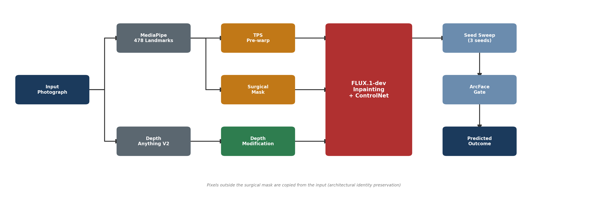
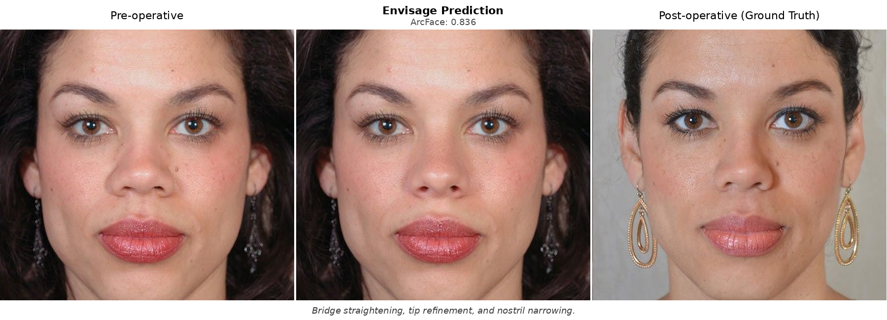
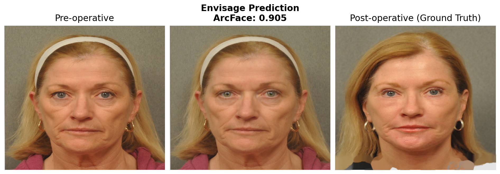
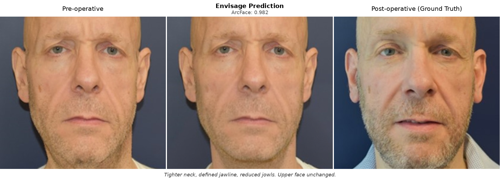
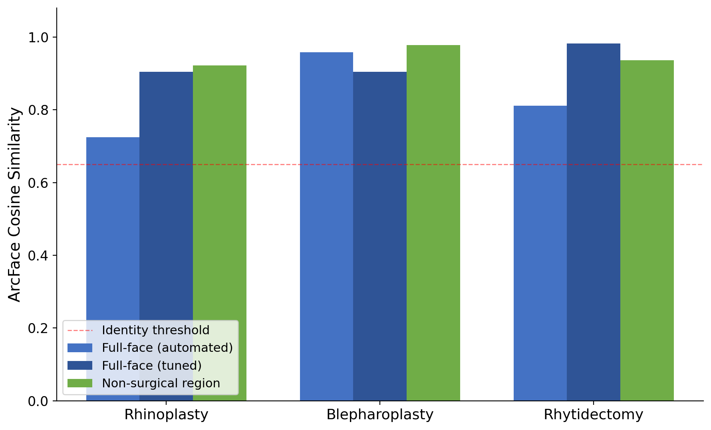

<p align="center">
  <picture>
    <source media="(prefers-color-scheme: dark)" srcset="assets/pipeline.png">
    <source media="(prefers-color-scheme: light)" srcset="assets/pipeline.png">
    
  </picture>
</p>
<h1 align="center">Envisage</h1>
<p align="center">
  <em>Depth-conditioned diffusion inpainting for facial surgery outcome prediction</em>
</p>

<p align="center">
  <a href="https://huggingface.co/spaces/dreamlessx/envisage"></a>
  <a href="#license"></a>
  <a href="https://www.python.org/downloads/"></a>
  <a href="https://pytorch.org/"></a>
  <a href="https://github.com/astral-sh/ruff"></a>
</p>

Predict what a patient will look like after facial surgery from a single photograph. Zero training required. Identity preserved by architecture, not optimization.

<table align="center">
<tr>
<td width="50%" valign="top">

**Input & Output**
- Single 2D photo: any clinical photo or phone selfie
- Photorealistic post-op prediction via inpainting
- Only the surgical region is regenerated; the rest is pixel-identical

</td>
<td width="50%" valign="top">

**Capabilities**
- **3 procedures:** rhinoplasty, blepharoplasty, rhytidectomy
- **Zero-shot:** pretrained FLUX.1-dev + depth ControlNet, no fine-tuning
- **Adaptive anatomy:** mask dilation, depth kernels, and TPS warp scale with measured facial dimensions

</td>
</tr>
</table>

---

## Why Envisage

Existing approaches to surgical outcome prediction fall into five categories. Each has a fundamental limitation that Envisage addresses.

| Approach | Examples | Core limitation | Envisage alternative |
|:---------|:---------|:----------------|:---------------------|
| Commercial hardware systems | Crisalix, Vectra 3D | $30,000-50,000 dedicated hardware; proprietary; results not reproducible | Single 2D photo input. Open-source code and evaluation framework. |
| GAN-based prediction | Jung et al. (2022) | 52.5% Visual Turing test: predictions are distinguishable from real outcomes nearly half the time | FLUX.1-dev produces photorealistic 1024x1024 outputs zero-shot. |
| Landmark-conditioned diffusion | LandmarkDiff (our prior work) | 97% of identity score came from compositing, not the model. SD 1.5 at 512x512 lacked resolution for clinical detail. | Inpainting preserves identity architecturally. Decomposed ArcFace prevents compositing from inflating metrics. |
| Generic face editors | DragDiffusion, FaceApp | No anatomical priors, no procedure-specific guidance, no clinical evaluation | Depth conditioning maps to tissue displacement. Parameters scale with measured anatomy per procedure. |
| 3D morphable models | ACMT-Net, GPOSC-Net | Require CT scans or multi-view input; not accessible from a single photograph | Works from one photo. No CT scans, no depth sensors, no multi-view capture. |

**What makes Envisage different:**

- **Zero training.** Works out of the box with pretrained FLUX.1-dev. No fine-tuning, no task-specific dataset collection.
- **Architectural identity preservation.** The inpainting formulation copies all pixels outside the surgical mask. Identity is preserved by construction, not by optimization.
- **Depth conditioning.** Modified depth maps encode the intended tissue displacement, giving the diffusion model explicit 3D guidance about the surgical change.
- **Adaptive anatomy.** Mask dilation, depth kernels, and TPS warp parameters scale with measured facial dimensions. Nothing is a fixed pixel offset.
- **Honest evaluation.** Decomposed ArcFace separates surgical from non-surgical regions, preventing compositing artifacts from inflating identity scores.
- **Single 2D photo input.** No CT scans, no depth sensors, no multi-view rigs. A clinical photo or phone selfie is sufficient.
- **Open source.** Full pipeline code, evaluation framework, and paper are publicly available.

---

### Where We're Headed

Envisage ships as a zero-shot inpainting system built on FLUX.1-dev. The approach works well for focal procedures (rhinoplasty, blepharoplasty) where the surgical region is small relative to the face. The next steps are: (1) add interactive intensity control so clinicians can preview subtle through aggressive versions of a procedure; and (2) move toward 3D: reconstruct a face model from a short phone video and apply surgical deformations in 3D space for multi-angle visualization. No depth sensors, no clinical scanning rigs. Just a phone camera.

> **Paper:** "Envisage: Depth-Conditioned Diffusion Inpainting for Facial Surgery Outcome Prediction," under review, 2026.

<br>

---

## Table of Contents

- [Why Envisage](#why-envisage)
- [Design Decisions from LandmarkDiff](#design-decisions-from-landmarkdiff)
- [Pipeline](#pipeline)
- [Demo Outputs](#demo-outputs)
- [Quick Start](#quick-start)
- [Evaluation](#evaluation)
- [Results](#results)
- [Monk Skin Tone Equity](#monk-skin-tone-equity)
- [Project Structure](#project-structure)
- [Configuration](#configuration)
- [Citation](#citation)
- [License](#license)
- [Clinical Disclaimer](#clinical-disclaimer)

<br>

---

## Design Decisions from LandmarkDiff

Our earlier system, [LandmarkDiff](https://github.com/dreamlessx/LandmarkDiff-public), used SD 1.5 conditioned on sparse landmark wireframes. Five architectural decisions proved counterproductive. Envisage is the result of correcting each one.

| LandmarkDiff | Envisage | Why |
|:-------------|:---------|:----|
| SD 1.5 at 512x512 | FLUX.1-dev at 1024x1024 | Sufficient resolution for clinical facial detail |
| Sparse wireframe conditioning | Dense depth maps (Depth Anything V2) | No information loss between landmarks |
| Full-face generation + compositing | Inpainting | Architectural identity preservation; non-surgical pixels are never regenerated |
| TPS synthetic training data | Zero-shot pretrained weights | Avoids geometric artifacts from training on warped faces |
| Full-face ArcFace only | Decomposed evaluation | Prevents compositing from inflating identity metrics |

---

## Pipeline

<div align="center">

<br>
<em>Full pipeline: input photo, landmark extraction, TPS pre-warp, depth modification, FLUX.1-dev inpainting, seed sweep</em>
</div>

<br>

The pipeline has six stages. Each is independently testable and configurable per procedure.

### Stage 1: Landmark Extraction

MediaPipe extracts 478 facial landmarks to localize the surgical region and compute anatomical measurements (nose width, eyelid hooding distance, jaw contour length). These measurements drive all downstream parameters.

### Stage 2: TPS Pre-Warp

Procedure-specific thin-plate spline warp applies geometric changes before diffusion. For rhinoplasty: bridge thinning and tip refinement. For blepharoplasty: eyelid lift. Parameters scale with the measured anatomy, not fixed pixel offsets.

### Stage 3: Mask Generation

Convex hull of procedure-specific landmarks, dilated and feathered. Blepharoplasty uses adaptive per-eye dilation proportional to measured hooding. Rhytidectomy follows the jaw contour. The mask defines which pixels the diffusion model may modify. Everything outside is copied from the input.

### Stage 4: Depth Modification

Gaussian displacement kernels simulate tissue changes on the Depth Anything V2 depth map. Kernel size and intensity scale with measured nose dimensions, eyelid crease distance, or jaw width. This gives the diffusion model explicit 3D guidance about the intended surgical change.

### Stage 5: FLUX.1-dev Inpainting

A pretrained depth ControlNet conditions the diffusion model on the modified depth map. Only the masked region is regenerated. Pixels outside the mask are copied from the input. Identity preservation is architectural, not learned.

### Stage 6: Seed Sweep

Three seeds are tried; the output with the highest ArcFace cosine similarity to the input is returned. This compensates for diffusion stochasticity without requiring model fine-tuning.

No task-specific training is required. The pretrained depth ControlNet generalizes to surgical depth modifications zero-shot.

---

## Demo Outputs

### Rhinoplasty

<div align="center">


*Sculpted bridge with defined tip. Depth modification creates a taller, straighter bridge profile. ArcFace: 0.892.*
</div>

### Blepharoplasty

<div align="center">


*Upper eyelid de-hooding. Tiny mask (1.6% of face) with adaptive asymmetric correction. ArcFace: 0.905.*
</div>

### Rhytidectomy

<div align="center">


*Neck tightening and jawline definition. The upper face is pixel-identical to the input. ArcFace: 0.982.*
</div>

---

## Quick Start

**Prerequisites:** Python 3.10+ and PyTorch 2.5+ ([install guide](https://pytorch.org)). GPU with 24 GB+ VRAM required (A6000, L40S, A100, or H100).

```bash
git clone https://github.com/dreamlessx/envisage_public.git
cd envisage_public

pip install -r requirements.txt
```

### Run the Gradio demo

```bash
python app.py
# Opens at http://localhost:7860
```

### Run a single prediction

```bash
python -m envisage.pipeline \
    --image /path/to/face.jpg \
    --procedure rhinoplasty
```

### Try the live demo

<p align="center">
  <a href="https://huggingface.co/spaces/dreamlessx/envisage">
    
  </a>
</p>

---

## Evaluation

Envisage includes a decomposed evaluation framework that measures identity preservation separately on the surgical region, non-surgical region, and full face. This was motivated by finding that LandmarkDiff's identity scores were 97% attributable to composited (unmodified) pixels.

Metrics:

| Metric | What it measures | How it's computed |
|--------|-----------------|-------------------|
| ArcFace | Identity preservation | Cosine similarity between input and output face embeddings (IResNet-50, 512-dim) |
| LPIPS | Perceptual similarity | Learned Perceptual Image Patch Similarity (AlexNet backbone) |
| DISTS | Structural + texture | Deep Image Structure and Texture Similarity |
| KID | Distribution realism | Kernel Inception Distance |

### Running evaluation

```bash
python -m envisage.evaluation \
    --pred_dir output/predictions/ \
    --target_dir data/targets/ \
    --output eval_results.json
```

---

## Results

Evaluated on the [HDA Plastic Surgery Database](https://doi.org/10.1109/CVPRW50498.2020.00425) (Rathgeb et al., CVPRW 2020). 637 total pairs, 104 test pairs from an 80/20 stratified split across three procedures.

### Comparison with LandmarkDiff

| Procedure | N | Envisage ArcFace | LandmarkDiff ArcFace | Envisage LPIPS |
|:----------|:---:|:---:|:---:|:---:|
| Rhinoplasty | 34 | **0.725** | 0.607 | **0.348** |
| Blepharoplasty | 51 | **0.958** | 0.670 | 0.403 |
| Rhytidectomy | 19 | **0.811** | 0.360 | 0.471 |
| **Overall** | **104** | **0.871** | 0.551 | **0.397** |

LandmarkDiff scores include compositing (pasting the generated face back onto the original image). Without compositing, LandmarkDiff rhinoplasty ArcFace drops from 0.607 to 0.023, indicating the SD 1.5 model contributed almost no identity preservation on its own. Envisage scores are reported without compositing; the inpainting formulation inherently preserves non-surgical pixels.

### Decomposed Identity Evaluation

<div align="center">


*Non-surgical region scores near 1.0 confirm that inpainting preserves identity outside the mask.*
</div>

| Region | ArcFace |
|:-------|:---:|
| Full face | 0.871 |
| Non-surgical region | 0.922-0.978 |

> Rhinoplasty is the weakest procedure (0.725) due to the subtle nature of nasal changes that depth modification alone does not fully capture. All three procedures exceed the 0.65 identity-preservation threshold.

---

## Monk Skin Tone Equity

All metrics are stratified by the 10-point Monk Skin Tone (MST) Scale to evaluate fairness across skin tones. MST classification is performed automatically from the input photo.

| MST | Label | N | ArcFace |
|:---:|:------|:---:|:---:|
| 3 | Light-Medium | 2 | 0.886 |
| 5 | Medium | 35 | 0.872 |
| 6 | Medium-Dark | 23 | 0.879 |
| 7 | Dark-Medium | 4 | 0.793 |
| 8 | Dark | 1 | 0.964 |

All tone groups exceed the 0.65 identity threshold. The dataset's skin tone distribution is narrow (MST 3-8 only), which limits conclusions about equity across the full MST range. Broader evaluation on a more diverse dataset is planned.

---

## Project Structure

```
envisage/
  landmarks.py      MediaPipe 478-point mesh + anatomical measurements
  masks.py          Procedure-specific adaptive surgical masks
  depth.py          Depth Anything V2 + adaptive depth modification
  hybrid.py         TPS geometric pre-warp
  pipeline.py       Unified pipeline with validation + seed sweep
  evaluation.py     Decomposed ArcFace, DISTS, KID metrics
  fairness.py       Monk Skin Tone Scale classifier
  postprocess.py    ArcFace identity gate
app.py              Gradio demo
paper/              Manuscript (LNCS + arXiv)
  arxiv/            arXiv submission
  supplementary.tex Supplementary material
configs/            Procedure configs
assets/             Result images
hf_space/           HF Spaces deployment
```

---

## Configuration

Procedure-specific parameters are defined in `configs/`. Each config controls:

| Parameter | Description |
|-----------|-------------|
| `landmarks` | MediaPipe landmark indices for the surgical region |
| `mask_dilation` | Base dilation (pixels), scaled by anatomy |
| `depth_kernel_size` | Gaussian kernel for depth modification |
| `depth_intensity` | Displacement magnitude, scaled by measured anatomy |
| `tps_handles` | Thin-plate spline control points and target displacements |
| `controlnet_scale` | Depth ControlNet conditioning strength |
| `num_seeds` | Number of seeds for the sweep (default: 3) |

All spatial parameters (dilation, kernel size, displacement) are specified relative to anatomical measurements rather than absolute pixel values. This makes the pipeline resolution-independent and adapts automatically to different face sizes.

---

## Citation

```bibtex
@inproceedings{envisage2026,
  title={Envisage: Depth-Conditioned Diffusion Inpainting for Facial Surgery Outcome Prediction},
  author={Agarwal, Mudit},
  booktitle={Under Review},
  year={2026}
}
```

---

## License

This project is released for research use only. FLUX.1-dev is released under a non-commercial license by Black Forest Labs. See [LICENSE](LICENSE) for details.

---

## Clinical Disclaimer

> [!CAUTION]
> **This is a research tool, not a medical device.**
>
> Predictions are approximations generated by a diffusion model and do not reflect actual surgical outcomes. Outputs should always be reviewed by a qualified clinician before being shown to patients. The authors make no clinical claims about prediction accuracy or suitability for surgical planning. Do not use this system for clinical decision-making without independent professional validation. FLUX.1-dev is released under a non-commercial license by Black Forest Labs.
