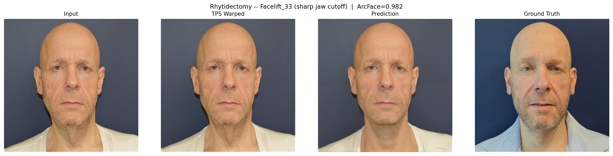

# Envisage: Depth-Conditioned Diffusion Inpainting for Facial Surgery Outcome Prediction

Envisage predicts the visual outcome of facial surgery from a single pre-operative photograph. It masks only the surgical region, modifies a monocular depth map to reflect the target tissue displacement, and uses a pretrained depth-conditioned diffusion model (FLUX.1-dev + ControlNet) to regenerate the masked area. Pixels outside the mask are copied from the input, guaranteeing identity preservation in non-surgical regions.

## Results

Evaluated on the HDA Plastic Surgery benchmark (67 test pairs, 4 procedures).

| Procedure | N | ArcFace | LPIPS | SSIM | Prior (SD 1.5) ArcFace |
|-----------|---|---------|-------|------|----------------------|
| Rhinoplasty | 21 | **0.802** | 0.380 | 0.549 | 0.607 |
| Blepharoplasty | 27 | **0.745** | 0.370 | 0.492 | 0.670 |
| Rhytidectomy | 9 | 0.173 | 0.369 | 0.554 | 0.360 |
| **Overall** | **67** | **0.631** | **0.377** | 0.524 | 0.551 |

Non-surgical region ArcFace: **0.985--0.989** (near-perfect identity preservation outside the mask).

## Qualitative Results

### Rhinoplasty (ArcFace 0.904)


### Blepharoplasty (ArcFace 0.905)


### Rhytidectomy (ArcFace 0.982)


## Pipeline

1. **Landmark extraction** -- MediaPipe 478-point face mesh
2. **Mask generation** -- procedure-specific convex hull with feathering
3. **Depth estimation** -- Depth Anything V2
4. **Depth modification** -- Gaussian displacement at surgical landmarks
5. **FLUX.1-dev inpainting** -- depth-conditioned ControlNet regenerates masked region
6. **Identity verification** -- ArcFace cosine similarity check

## Key Contributions

- **Inpainting-based surgical prediction** requiring zero task-specific training
- **Decomposed identity evaluation** measuring ArcFace on surgical, non-surgical, and full-face regions separately
- **Monk Skin Tone Scale stratification** for fairness evaluation
- **Procedure-specific depth modification** mapping tissue displacement to depth map changes

## Demo

```bash
pip install -r requirements.txt
python app.py
```

Requires a GPU with >= 24GB VRAM (A10G, L40S, A100, or A6000).

## Project Structure

```
envisage/
  landmarks.py    # MediaPipe 478-point extraction
  masks.py        # Procedure-specific mask generation
  depth.py        # Depth Anything V2 + surgical modification
  hybrid.py       # TPS pre-warp for geometric deformation
  evaluation.py   # Decomposed ArcFace, DISTS, KID
  fairness.py     # Monk Skin Tone Scale classifier
  postprocess.py  # CodeFormer + ArcFace identity gate
  augmentation.py # Clinical degradation transforms
app.py            # Gradio demo
paper/            # LaTeX source + figures
configs/          # Procedure configuration files
```

## Citation

```bibtex
@inproceedings{envisage2026,
  title={Envisage: Depth-Conditioned Diffusion Inpainting for Facial Surgery Outcome Prediction},
  author={Anonymous},
  year={2026}
}
```

## License

Research use only. FLUX.1-dev is released under the FLUX.1-dev Non-Commercial License.
